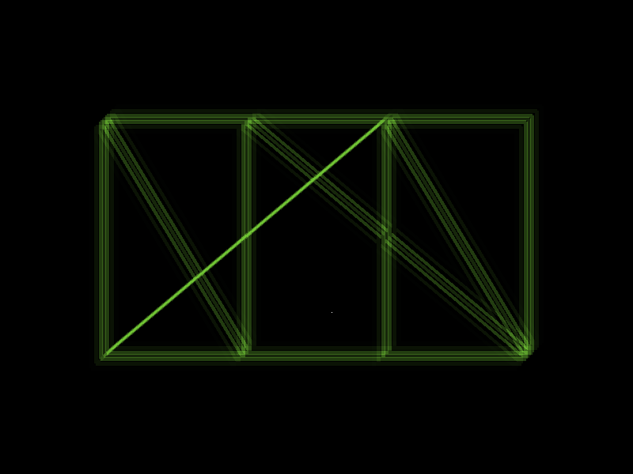

# OpenGL Post Processing



## Quick Start

### Linux

```console
$ make
$ ./pp
```

### MSVC

```cmd
> setup_glfw.bat
> build_msvc.bat
> pp
```

## References

- http://www.opengl-tutorial.org/beginners-tutorials/tutorial-4-a-colored-cube/#draw-a-cube
- http://www.opengl-tutorial.org/intermediate-tutorials/tutorial-14-render-to-texture/
- https://community.khronos.org/t/fbo-missing-attachment-issue/69868
- https://github.com/Jam3/glsl-fast-gaussian-blur
